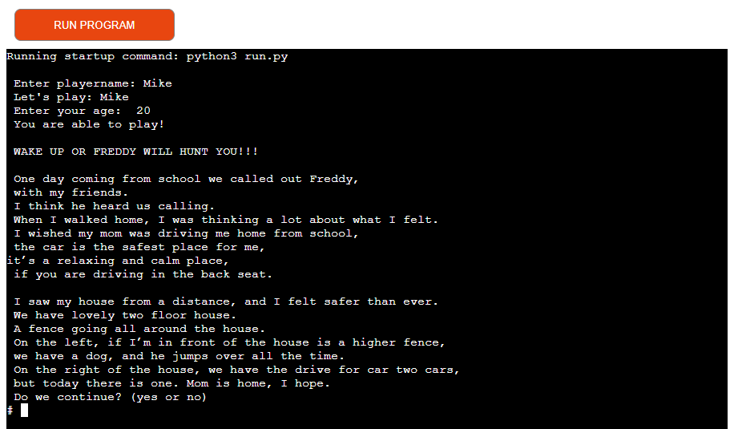

# Welcome to Text Adventure Game called "Wakeup."

[Wakeup game](https://myfirstapptextadventure.herokuapp.com/)

This is Portfolio Project 3 made on Python. Runs on Code Institute mock and Heroku.

Game play is simple text based game where you need to read and make a correct decision, and answer a simple question. 
If you make all the right decision you will finish the game.

## How to play

* Text Adventure Game is old and easy to play. Find more in [Wikipedia](https://en.wikipedia.org/wiki/Text-based_game)
* The Player needs to enter his name and age(there is a age limit 18+)
* Player answers simple questions what will be in end of the text.
* Goal of the game is to get end to the game!

## Features.

* Player name:

* Age confirmation 18+.

* Player input.

* New game.

* Wrong answer or input error.

# Future features.

Player collects and store something for later ( key, coyne...) 
Disain back ground and make every text in new page.
Make some background sounds like door opens or sound of fire.

# Testing.

Tested on PEP8 and didn't get any errors.
Fixed all the problemes when I got the error ( like cols was over 82 or other unexpected error).

# Bugs.
* Had some issiuse with add pictures to readme file.
All fixed and problem solved. error was cap in picture name.
No bugs remaining.

# Validator Testing.

Didn't get any errors on pep8online.com testing.

# Big Thank you:

* Heroku app.
* Slack team and mentors.
* Code Institute program.
* All online availebel research.
* Youtube

## Enjoy the GAME!!!

